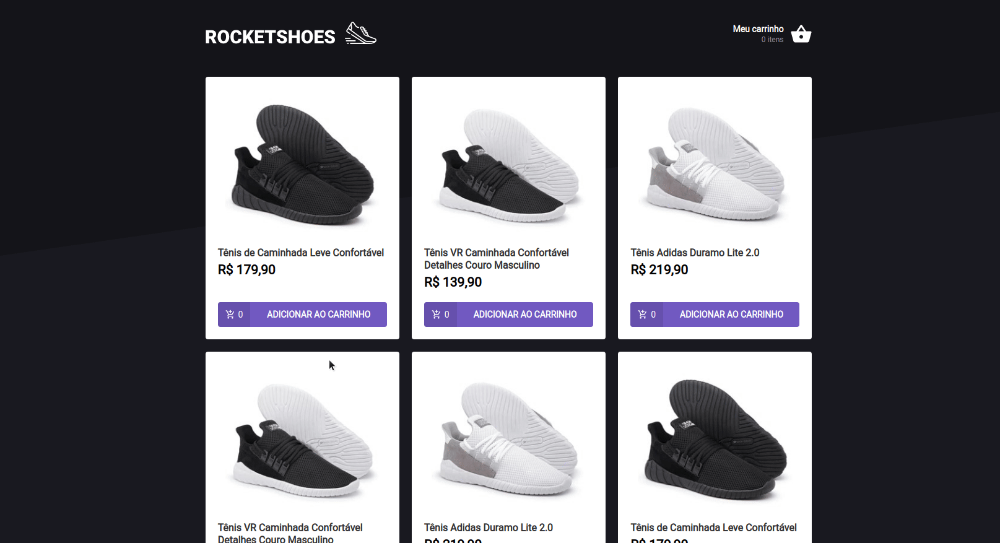

# :shopping_cart: RocketShoes App

:rocket: Desafio 01 proposto no módulo 2 do Ignite (Rocketseat) onde é trabalhada a criação de um **_Hook_** de carrinho de compras da aplicação usando **_ReactJS_**.

#### Funcionalidades

- Buscar produtos da FakeAPI (**_JSON Server_**) e formatar o preço utilizando o helper `utils/format`;
- Adicionar produtos ao carrinho;
- Remover produtos do carrinho;
- Ao adicionar o mesmo produto, apenas alterar a quantidade;

##### Extra:

- Imagem de carrinho vazio caso não haja produtos no mesmo.

